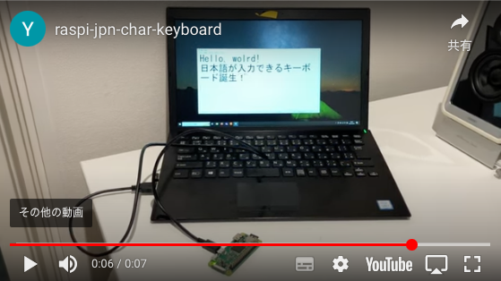

# Raspberry Pi Zero W USB HID キーボード  
**日本語漢字入力対応**

このリポジトリは、Raspberry Pi Zero W を USB Gadget モードで動作させ、ホスト（例：Windows PC）に対してキーボード入力をエミュレートするためのスクリプト群をまとめたものです。特に、ASCII文字だけでなく日本語の漢字など非ASCII文字も入力できる点が特徴です。  
ホストPCの Windows 10 の IME を ON にした状態で動作します。  

[](https://www.youtube.com/watch?v=QMJmQvIDZQU){:target="_blank"}


---

## 特徴

- **USB HID Gadget モード**  
  Raspberry Pi Zero W を USB キーボードとして利用可能。

- **Unicode・日本語対応**  
  ASCII文字は「全角半角」キーのトグルを利用し、非ASCII文字（例：漢字）の場合は Unicode コードポイントの16進数表現を送信。その後、変換用の `F5` キーと `Enter` キーを送ることでホスト側で日本語変換が可能な仕組み。

- **簡単なセットアップ＆クリーンアップ**  
  systemd を用いたサービス登録スクリプトおよび、不要時に削除するためのクリーンアップスクリプトを同梱。

---

## 含まれる主なファイル

- **send_key_via_hid.py**  
  指定したテキストファイルの内容を読み込み、対応するキーストロークを HID デバイス（例：`/dev/hidg0`）へ送信する Python スクリプト。

- **sample.txt**  
  テスト用のサンプルテキスト（ASCII と日本語が混在）  
  > *Hello, wolrd!*  
  > *日本語が入力できるキーボード誕生！*

- **setup_scripts/setup_usb_hid_gadget.sh**  
  USB Gadget（HID だけの複合デバイス）の設定を行うスクリプト。

- **setup_scripts/setup_usb_hid_gadget_service.sh**  
  上記の USB Gadget 設定スクリプトを `/usr/local/bin/` に配置し、systemd サービスとして登録・有効化するためのスクリプト。

- **setup_scripts/cleanup_usb_hid_gadget_service.sh**  
  systemd サービスの停止、無効化、関連ファイルの削除を行うクリーンアップスクリプト。

---

## ハードウェア要件

- Raspberry Pi Zero W
- micro-USB ケーブル（ホスト接続用）
- キーボードとして入力を受けるホストの Windows PC

---

## ソフトウェア要件

- Raspberry Pi OS（USB Gadget 機能が有効なもの）
- Python 3
- systemd（サービス管理用）
- Linux カーネルの `libcomposite` モジュール（通常は標準搭載）

---

## セットアップ手順

### 0. OS イメージの書き込みおよび USB Gadget モード有効化のための設定

Raspberry Pi Imager などで OS イメージを microSD カードに書き込んだ後、PC で microSD カード内の設定ファイルを編集して、USB Gadget モードが正しく有効になるように調整します。

#### 0.1. **cmdline.txt** の編集

**/boot/firmware/cmdline.txt** をテキストエディタで開き、modules-load=dwc2 が rootwaitの直後に書かれていることを確認してください。  
（例）

```txt
console=serial0,115200 console=tty1 root=PARTUUID=503e009b-02 rootfstype=ext4 fsck.repair=yes rootwait modules-load=dwc2 quiet splash plymouth.ignore-serial-consoles cfg80211.ieee80211_regdom=JP
```

- この設定により、起動時に `dwc2` モジュールが自動的にロードされ、USB Gadget モードが有効になります。  
- **注意:** このファイルは**1行**で記述されています。改行や余計な空白を入れないようにしてください。

#### 0.2. **config.txt** の編集

**/boot/firmware/config.txt** をテキストエディタで開き、以下のように編集してください。  
特に、**`dtoverlay=dwc2`** の記述は **`max_framebuffers=2`** の直後に追記することが重要です。

```ini
# Enable DRM VC4 V3D driver
dtoverlay=vc4-kms-v3d
max_framebuffers=2

dtoverlay=dwc2

# Don't have the firmware create an initial video= setting in cmdline.txt.
# Use the kernel's default instead.
disable_fw_kms_setup=1

# Disable compensation for displays with overscan
disable_overscan=1

# Run as fast as firmware / board allows
arm_boost=1
```

- **ポイント:** `dtoverlay=dwc2` は必ず `max_framebuffers=2` の**直後**に記述してください。順序が異なると、USB Gadget モードが正しく動作しない場合があります。

---

### 1. USB Gadget のセットアップ

1. **Raspberry PiとホストPCの接続**

   Raspberry Pi Zero W には、**USB** ポートと **PWR IN** ポートという 2 つの microUSB ポートがあります。  
   **ホストPCと接続する際は、必ず「USB」と刻印されたポートを使用してください。**

   ホストPCに接続するRaspberry PiのUSBポートを間違えないように注意深く確認してホストPCと接続しRaspberry Piの電源を入れます。

   
   ```mermaid
    flowchart TD
        host[Host PC]
        subgraph RPi[ Raspberry Pi Zero W ]
            USB[USB Port]
            PIN[Power IN Port]
        end
        host -- "◯正しい接続<br>(ガジェットモード有効)" --> USB
        host -- "×誤った接続<br>(ガジェットモード無効)" --> PIN
    ```


2. **リポジトリのクローン**

   ```bash
   git clone git@github.com:yossato/raspi-jpn-char-keyboard.git
   ```

3. **サービス用スクリプトの確認と実行**  
   リポジトリ内には、次の重要なスクリプトが含まれています:

   - `setup_usb_hid_gadget_service.sh`  
     → systemd サービスファイルを作成し、USB HID Gadget モードの自動起動を設定します。  
     ※実行権限がない場合は、`chmod +x setup_usb_hid_gadget_service.sh` を実行してください。

   - `setup_usb_hid_gadget.sh`  
     → 実際の USB HID キーボードとしての各種設定を行います。

   - `cleanup_usb_hid_gadget_service.sh`  
     → 設定を解除するためのクリーンアップスクリプトです。


4. **USB Gadget サービスの登録**  
   
   起動後、`setup_scripts` ディレクトリに移動し、サービス登録スクリプトを実行します。  
   ```bash
   cd setup_scripts
   sudo ./setup_usb_hid_gadget_service.sh
   ```
   このスクリプトは以下の処理を行います:
   - `setup_usb_hid_gadget.sh` を `/usr/local/bin/` にコピーし、実行権限を付与
   - `/etc/systemd/system/` にサービスファイルを作成し、USB Gadget の設定を行うサービスを登録
   - サービスを有効化し、起動して USB Gadget の設定を反映

---

### 2. キーストローク送信の実行

1. **Windows のホストPCの準備**  
   Windows 側でメモ帳などを起動し、IME を ON にした状態で日本語で文字入力できる状態にします。

2. **テキストファイルの準備**  
   Raspberry Pi側で送信したい内容を記述したテキストファイル（例：`sample.txt`）を用意します。

3. **Python スクリプトの実行**  
   以下のコマンドで、HID デバイス（通常は `/dev/hidg0`）に対してキーストロークを送信します。  
   ```bash
   python3 send_key_via_hid.py -d /dev/hidg0 -t sample.txt
   ```
   - `-d` または `--device_path` オプションで HID デバイスのパスを指定  
   - `-t` または `--text` オプションで送信するテキストファイルを指定

*注意:*  
- `/dev/hidg0` は USB Gadget モードで生成されるデバイスファイルです。  
- デバイスファイルへの読み書き権限はデフォルトで666に設定されるようにsystemdサービスの中で毎回設定していますが、セキュリティーを考慮する場合は適宜アクセス権を設定してください。


---

### 3. クリーンアップ（不要になった場合）

USB HID Gadget サービスや関連ファイルを削除する場合は、以下のスクリプトを実行してください。  
```bash
cd setup_scripts
sudo ./cleanup_usb_hid_gadget_service.sh
```
このスクリプトは、サービスの停止・無効化、サービスファイルおよび gadget スクリプトの削除を行います。

---

## 動作の仕組み

- **ASCII文字の送信**  
  ASCII文字（および半角英数字）は、送信前後に「全角半角」キーを押すことで、ホスト側の入力モード（日本語/英数字の切り替え）に対応させています。

- **非ASCII文字（例：日本語）の送信**  
  対象の文字を Unicode コードポイントに変換し、その 16 進数表記の各桁を個別にキーストロークとして送信します。最後に `F5` キーを押して変換をトリガーし、`Enter` キーで確定させる仕組みです。

---

## トラブルシューティング

- **HID デバイスが見つからない場合**  
  - USB Gadget サービスが正しく動作しているか確認してください。  
  - `/dev/hidg0` などのデバイスファイルが存在するか確認します。

- **入力が正しく行われない場合**  
  - ホスト側の入力システム（日本語入力システム等）が、送信されるキーストローク列を正しく解釈できるか確認してください。  
  - 必要に応じて、各種タイミング（`sleep` の値など）の調整を検討してください。

- **権限エラー**  
  システムファイルやデバイスファイルにアクセスするため、必要に応じて `sudo` を利用してください。

---

## ライセンス

本プロジェクトは BSD 2-Clause License の下で公開されています。詳細は [LICENSE](LICENSE) をご確認ください.
